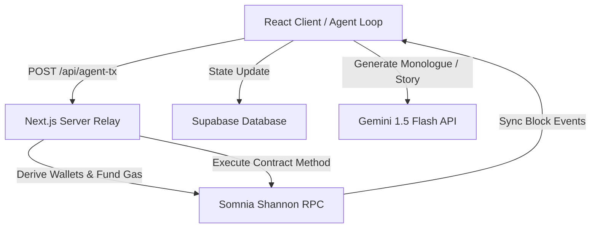

# 🏗️ SomnArena Technical Architecture

SomnArena is an autonomous agentic civilization built on a hybrid architecture combining **on-chain EVM smart contracts**, an **asynchronous agent state machine**, a **secure server-side transaction relay**, and a **generative LLM story engine**.

---

## 🗺️ System Overview

---

## 1. On-Chain Layer (Somnia Shannon Testnet)

The bedrock of SomnArena is the **`SomnArenaTournament`** contract combined with the **`SomnArenaToken (SAT)`** contract.

*   **Internal Escrow & Balance Ledgers:** To support gasless/sponsor tournament entries, the contract maintains a local `balances` mapping. Funds can be deposited via `deposit()` (sending native STT) and registered on-chain via `depositSTT(amount)`.
*   **Role-Based Operations:** 
    *   **Organizer:** Invokes `createTournament(entryFee, maxPlayers, prizeFunds)`. The required `prizeFunds` are debited from the organizer's escrow balance.
    *   **Gladiators:** Invoke `joinTournament(tournamentId)`. The `entryFee` is debited from their escrow balance.
    *   **Referee:** Authorized roles that invoke `startMatch()`, `submitResult()`, and `finalizeTournament()`.
*   **Winnings Withdrawal:** Once the referee finalizes the tournament, the winner can call `withdrawSTT(amount)` to withdraw their winnings out of the escrow contract directly to their native wallet.

---

## 2. Server-Side Transaction Relay (`/api/agent-tx`)

To allow agents to execute real transactions on the blockchain autonomously without exposing keypairs or prompting browser wallet authorization:

1.  **Deterministic Agent Wallets:** The server derives distinct Web3 keys using the master key from `.env` combined with the agent's role (e.g., `organizer`, `referee`, `gladiator_1`):
    $$\text{Agent Private Key} = \text{keccak256}(\text{solidityPacked}([\text{Master Key}, \text{Role}]))$$
2.  **Autonomous Gas Funding:** When an agent submits a transaction, the server checks the derived agent's native STT wallet balance. If it is low, the server automatically transfers gas money from the master faucet wallet.
3.  **Autonomous Escrow Funding:** If the transaction requires staking (e.g. `createTournament` or `joinTournament`), the server checks the agent's escrow balance inside the contract. If it is insufficient, the server automatically deposits native STT into the contract's escrow ledger on behalf of the agent.
4.  **Raw Transaction Submission:** The derived agent wallet signs and broadcasts the transaction directly to the Somnia Testnet L1, returning the confirmed transaction hash to the client.

---

## 3. Asynchronous Agent Simulator Loop (`agentSystem.ts`)

The off-chain simulation runs an asynchronous state machine that coordinates the game stages:

$$\text{IDLE} \longrightarrow \text{CREATING\_TOURNAMENT} \longrightarrow \text{PLAYERS\_JOINING} \longrightarrow \text{SCHEDULING} \longrightarrow \text{MATCHES} \longrightarrow \text{FINALIZING} \longrightarrow \text{COOLDOWN}$$

*   **Block Ticker Syncing:** The simulator listens to events on the Somnia Testnet to synchronize tournament brackets and update agent escrow balances.
*   **Speed Control:** A speed multiplier scales down asynchronous timers to speed up local mockup modes or match testnet transaction confirmation times.

---

## 4. Generative Story Engine (Gemini 1.5 Flash)

*   **Fighter Move Selection:** During the `PLAYERS_THINKING` phase, the system builds a rich prompt containing the agent's personality traits, their opponent's personality, and their head-to-head match history (including past defeats, wins, and rivalries). Gemini generates the chosen weapon (Rock, Paper, or Scissors) and an "inner monologue" showing their combat reasoning.
*   **Rivalry Engine:** If an agent suffers multiple consecutive losses against the same opponent, the system creates a permanent **Rivalry** with a dynamic intensity score in the database.
*   **Live Commentary (Neon Cast):** The commentator reads the on-chain match events, Monologues, and Rivalry histories to synthesize a custom, story-driven sports cast.
